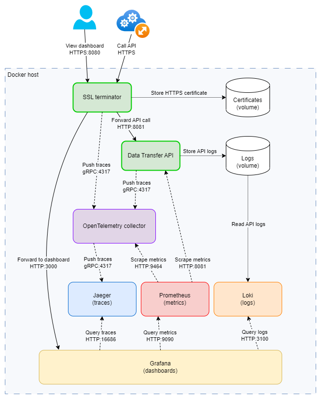

# EOSC Data Transfer Service

[EOSC Future](https://eoscfuture.eu) is an EU-funded Horizon 2020 project that is implementing
the [European Open Science Cloud](https://eosc-portal.eu) (EOSC). EOSC will give European
researchers access to a wide web of [FAIR data](https://en.wikipedia.org/wiki/FAIR_data)
and related services.

This project builds a generic data transfer service that can be used in EOSC to transfer
large amounts of data to cloud storage, by just indicating the source and destination.
The EOSC Data Transfer Service features a [RESTful](https://restfulapi.net) Application
Programming Interface (REST API).

The API covers three sets of functionalities:

- [Parsing digital object identifiers](#parsing-dois)
- [Creating and managing data transfers](#creating-and-managing-data-transfers)
- [Managing storage elements](#managing-storage-elements)

This project uses [Quarkus](https://quarkus.io), the Supersonic Subatomic Java Framework.


## Authentication and authorization

All three groups of API endpoints mentioned above support authorization.
The generic data transfer service behind the EOSC Data Transfer API aims to be agnostic
with regard to authorization, thus the HTTP header `Authorization` (if present) will be
forwarded as received.

> Note that the frontend using this API might have to supply more than one set of credentials:
> (1) one for the data repository (determined by the DOI used as the source), (2) one for
> the transfer service that is automatically selected when a destination is chosen, and (3) one
> for the destination storage system. Only (2) is mandatory.

The API endpoints that parse DOIs usually call APIs that are open access, however the
HTTP header `Authorization` (if present) will be forwarded as received. This ensures that
the EOSC Data Transfer API can be [extended with new parsers](#integrating-new-doi-parsers)
for data repositories that require authentication.

The API endpoints that create and manage transfers, as well as the ones that manage storage
elements, do require authorization, in the form of an access token passed via the HTTP
header `Authorization`. This gets passed to the
[transfer service registered to handle the destination storage](#3-register-new-destinations-serviced-by-the-new-data-transfer-service).
The challenge is that some storage systems used as the target of the transfer may need
a different authentication and/or authorization (than the one the transfer service uses).
Thus, an additional set of credentials can be supplied to the endpoints in these groups
via the HTTP header `Authorization-Storage`.

> For example, for transfers to [EGI dCache](https://www.dcache.org), the configured transfer service
> that handles the transfers is [EGI Data Transfer](https://www.egi.eu/service/data-transfer/).
> These both can use the same EGI Check-in access token, thus no additional credentials are needed
> besides the access token for the transfer service, passed via the `Authorization` HTTP header.

When used, the HTTP header parameter `Authorization-Storage` receives a
key value pair, separated by a colon (`:`), no leading or trailing whitespace, which
is [Base-64 encoded](https://en.wikipedia.org/wiki/Base64).

> For example, to pass a username and password to the destination storage, you construct
> a string like `username:password`, then Base-64 encoded it to `dXNlcm5hbWU6cGFzc3dvcmQ=`,
> and finally pass this through the HTTP header `Authorization-Storage` when calling
> e.g. the endpoint `GET /storage/folder/list`.

## Parsing DOIs

The API supports parsing digital object identifiers (DOIs) and will return a list of files
in the repository indicated by the DOI. It will automatically identify the DOI type and will
use the correct parser to retrieve the list of source files.

> DOIs are persistent identifiers (PIDs) dedicated to identification of content over digital networks.
> These are registered by one of the
> [registration agencies of the International DOI Foundation](https://www.doi.org/registration_agencies.html).
> Although in this documentation we refer to DOIs, the API endpoint that parses DOIs
> supports any PID registered in the [global handle system](https://www.dona.net/handle-system)
> of the [DONA Foundation](https://www.dona.net/digitalobjectarchitecture), provided it points
> to a data repository for which a parser is configured.


### Supported data repositories

The API supports parsing DOIs to the following data repositories:
- [Zenodo](https://zenodo.org/)
- [B2SHARE](https://eudat.eu/catalogue/B2SHARE)
- Any data repository that supports [Signposting](https://signposting.org)


### Integrating new DOI parsers

The API endpoint `GET /parser` that parses DOIs is extensible. All you have to do is
implement the parser interface for a specific data repository, then register
the Java class implementing the interface in the configuration.

#### 1. Implement the interface for a generic DOI parser

Implement the Java interface `ParserService` in a class of your choice.

```java
public interface ParserService {
    boolean init(ParserConfig config, PortConfig port);
    String getId();
    String getName();
    String sourceId();
    Uni<Tuple2<Boolean, ParserService>> canParseDOI(String auth, String doi, ParserHelper helper);
    Uni<StorageContent> parseDOI(String auth, String doi, int level);
}
```

> Your class must have a constructor that receives a `String id`, which must be returned
> by the method `getId()`.

When the API `GET /parser` is called to parse a DOI, all configured parsers will be tried,
by calling the method `canParseDOI()`, until one is identified that can parse the DOI. If no
parser can handle the DOI, the API fails. In case your implementation of the method
`canParseDOI()` cannot determine if your parser can handle a DOI just from the URL,
you can use the passed in `ParserHelper` to check if the URL redirects to the data
repository you support.

After a parser is identified, the methods `init()` and `parseDOI()` are called in order.

> The same `ParserHelper` is used when trying all parsers for a DOI. This helper caches the
> redirects, so you should try `getRedirectedToUrl()` before incurring one or more
> network calls by calling `checkRedirect()`.

#### 2. Add configuration for the new DOI parser

Add a new entry in the [configuration file](#configuration) under `eosc/parser` for the
new parser, with the following settings:

- `name` is the human-readable name of the data repository.
- `class` is the canonical Java class name that implements the interface `ParserService`
  for the data repository.
- `url` is the base URL for the REST client that will be used to call the API of this
  data repository (optional).
- `timeout` is the maximum timeout in milliseconds for calls to the data repository.
  If not supplied, the default value 5000 (5 seconds) is used.


## Creating and managing data transfers

The API supports creation of new data transfers (aka jobs), finding data transfers, querying information
about data transfers, and canceling data transfers.

Every API endpoint that performs operations or queries on data transfers or on storage elements
in a destination storage has to be passed a destination type. This selects the data transfer
service that will be used to perform the data transfer, freeing the clients of the API from
having to know which data transfer service to pick for each destination. **Each destination type
is mapped to exactly one data transfer service** in the
[configuration](#3-register-new-destinations-serviced-by-the-new-data-transfer-service).

Note that the API uses the concept of a **storage type**, instead of the protocol
type, to select the transfer service. This makes the API flexible, by allowing multiple
destination storages that use the same protocol to be handled by different transfer services,
but at the same time it also allows an entire protocol (e.g. FTP, see below) to be handled by
a specific transfer service.

> If you do not supply the `dest` query parameter when making an API call to
> perform a transfer or a storage element related operation or query, the default value
> `dcache` will be supplied instead.

### Supported transfer destinations

Initially, the [EGI Data Transfer](https://docs.egi.eu/users/data/management/data-transfer/)
is integrated into the EOSC Data Transfer API, supporting the following destination storages:

- [EGI dCache](https://www.dcache.org)
- [FTP servers](https://en.wikipedia.org/wiki/File_Transfer_Protocol)
- [S3-compatible](https://en.wikipedia.org/wiki/Amazon_S3) object storages


### Integrating new data transfer services

The API for creating and managing data transfers is extensible. All you have to do is implement the
generic data transfer interface to wrap a specific data transfer service, then register your class
implementing the interface as the handler for one or more destination storage types.

#### 1. Implement the interface for a generic data transfer service

Implement the Java interface `TransferService` in a class of your choice.

```java
public interface TransferService {
    boolean initService(TransferServiceConfig config);
    String getServiceName();
    boolean canBrowseStorage(String destination);
    String translateTransferInfoFieldName(String genericFieldName);
    Uni<UserInfo> getUserInfo(String tsAuth);

    // Methods for data transfers
    Uni<TransferInfo> startTransfer(String tsAuth, String storageAuth, Transfer transfer);
    Uni<TransferList> findTransfers(String tsAuth, String fields, int limit,
                                    String timeWindow, String stateIn,
                                    String srcStorageElement, String dstStorageElement,
                                    String delegationId, String voName, String userDN);
    Uni<TransferInfoExtended> getTransferInfo(String tsAuth, String jobId);
    Uni<Response> getTransferInfoField(String tsAuth, String jobId, String fieldName);
    Uni<TransferInfoExtended> cancelTransfer(String tsAuth, String jobId);

    // Methods for storage elements
    Uni<StorageContent> listFolderContent(String tsAuth, String storageAuth, String folderUrl);
    Uni<StorageElement> getStorageElementInfo(String tsAuth, String storageAuth, String seUrl);
    Uni<String> createFolder(String tsAuth, String storageAuth, String folderUrl);
    Uni<String> deleteFolder(String tsAuth, String storageAuth, String folderUrl);
    Uni<String> deleteFile(String tsAuth, String storageAuth, String fileUrl);
    Uni<String> renameStorageElement(String tsAuth, String storageAuth, String seOld, String seNew);
}
```

> Your class must have a constructor with no parameters.

The methods can be split into two groups:

- The methods for handling data transfers **must** be implemented
- The methods for storage elements **should** only be implemented for storage types
  for which the method `canBrowseStorage()` returns `true`.

#### 2. Add configuration for the new data transfer service

Add a new entry in the [configuration file](#configuration) under `eosc/transfer/service`
for the new transfer service, with the following settings:

- `name` is the human-readable name of this transfer service.
- `class` is the canonical Java class name that implements the interface `TransferService`
  for this transfer service.
- `url` is the base URL for the REST client that will be used to call the API of this transfer service.
- `timeout` is the maximum timeout in milliseconds for calls to the transfer service.
   If not supplied, the default value 5000 (5 seconds) is used.
- `trust-store-file` is an optional path to a keystore file containing certificates
  that should be trusted when connecting to the transfer service.
  Use it when the [CA](https://en.wikipedia.org/wiki/Certificate_authority) that issued the
  certificate(s) of the transfer service is not one of the well known-root CAs.
  The path is relative to folder `src/main/resources`.
- `trust-store-password` is the optional password to the keystore file.

#### 3. Register new destinations serviced by the new data transfer service

Add entries in the [configuration file](#configuration) under `eosc/transfer/destination`
for each destination storage type you want to support, and map it to one of the registered
transfer services.

The configuration of each storage type consists of:

- `service` is the key of the transfer service that will handle transfers to this storage type.
- `description` is the human-readable name of this storage type.
- `auth` is the type of authentication required by the storage system, one of these values:
  - **token** means the storage uses the same OIDC auth token as the transfer service
  - **password** means the storage needs a username and a password for authentication
  - **keys** means the storage needs an access key and a secret key for authentication

For storage types that are configured with either `password` or `keys` as the authentication
type, you will have to supply the HTTP header parameter `Authorization-Storage` when calling
the API endpoints. See [here](#authentication-and-authorization) for details.

#### 4. Add the new destinations in the enum of possible destination

In the enum `DataTransferBase.Destination` add new values for each of the storage types
you added in the previous step. Use the same values as the names of the keys.

This way each entry under the node `eosc/transfer/destination` in the configuration
file becomes one possible value for the destination storage parameter `dest` of the
API endpoints.


## Managing storage elements

A **storage element** is where user's data is stored. It is a generic term meant to
hide the complexity of different types of storage technologies. It can mean both
an element of the storage system's hierarchy (directory, folder, container, bucket, etc.)
and the entity that stores the data (file, object, etc.).  

The API supports managing storage elements in a destination storage. Each data transfer
service that gets integrated can optionally implement this functionality. Moreover, data
transfer services that support multiple storage types can selectively implement this
functionality for just a subset of the supported storage types (see the
method `TransferService::canBrowseStorage()`
[above](#1-implement-the-interface-for-a-generic-data-transfer-service)).

Clients can query if this functionality is implemented for a storage type by
using the endpoint `GET /storage/info`.

This functionality covers:

- listing the content of a storage element
- query information about a storage element
- rename a storage element (including its path, which means to move it)
- delete a storage element
- create a hierarchical storage element (folder/container/bucket)

> Storage elements that store data (files/objects) can only be created by a
> data transfer, not by the API endpoints in this group.


## Configuration

The application configuration file is in `src/main/resources/application.yml`.

See [here](#integrating-new-doi-parsers) for how to configure the data repository
parsers used by the API and [here](#integrating-new-data-transfer-services) for
how to extend the API with new transfer services and storage types.

The API automatically generates metrics for the calls to the endpoints. You can also enable
histogram buckets for these metrics, to support quantiles in the telemetry dashboards (e.g.
the 0.95-quantile aka the 95th percentile of a metric). List the quantiles you want to
generate under the setting `eosc/qos/quantiles`. Similarly, you can also enable buckets for
service level objectives (SLOs) by listing all SLOs for call duration, expressed in milliseconds,
under the setting `eosc/qos/slos`.

<!-- markdownlint-disable no-bare-urls -->
You can review the metrics generated by the API at http://localhost:8081/metrics
<!-- markdownlint-enable no-bare-urls -->

> The API needs a certificate for an EGI service account to
> [register and configure S3 storage systems](https://fts3-docs.web.cern.ch/fts3-docs/docs/s3_support.html)
> with the wrapped [EGI Data Transfer](https://docs.egi.eu/users/data/management/data-transfer/)
> service. Such a certificate is included in the file `src/main/resources/fts-keystore.jks`, but
> the password for this certificate is not included. [Contact EGI](https://www.egi.eu/contact-us/)
> to obtain a service account and a new certificate (together with its password) when deploying this API. 


## Running the API in dev mode

You can run your application in dev mode that enables live coding using:
```shell script
./mvnw compile quarkus:dev
```

<!-- markdownlint-disable no-bare-urls -->
Then open the Dev UI, which is available in dev mode only, at http://localhost:8081/q/dev/.
<!-- markdownlint-enable no-bare-urls -->


## Packaging and running the API

The application can be packaged using:
```shell script
./mvnw package
```
It produces the `quarkus-run.jar` file in the `target/quarkus-app/` directory.
Be aware that it’s not an _über-jar_ as the dependencies are copied into the
`target/quarkus-app/lib/` directory.

The application is now runnable using `java -jar target/quarkus-app/quarkus-run.jar`.

If you want to build an _über-jar_, execute the following command:
```shell script
./mvnw package -Dquarkus.package.type=uber-jar
```

The application, packaged as an _über-jar_, is now runnable using `java -jar target/*-runner.jar`.


## Running the API with telemetry using Docker Compose

You can use Docker Compose to easily deploy and run the EOSC Data Transfer API.
This will run multiple containers:

- This application that implements the REST API and serves it over HTTP
- SSL terminator - decrypts HTTPS traffic and forwards requests to the API
- OpenTelemetry collector - collects, batch processes, and forwards traces/logs/metrics
- Jaeger - receives traces
- Loki - receives logs
- Prometheus - receives and scrapes metrics
- Grafana - visualization of the telemetry dashboard

The architecture and interaction between these containers is illustrated below: 

<!-- markdownlint-disable no-inline-html -->
<p align="center" width="100%"></p>
<!-- markdownlint-enable no-inline-html -->

Steps to run the API in a container:

1. Copy the file `src/main/docker/.env.template` to `src/main/docker/.env`, then:
   * Provide the domain name and port where you will deploy the API in the environment
   variables `SERVICE_DOMAIN` and `SERVICE_PORT`, respectively.
   * Provide an email address in the environment variable `SERVICE_EMAIL` to be used,
   together with the domain name, to automatically request a SSL certificate for the
   SSL terminator.
   * In the environment variable `FTS_KEY_STORE_FILE` provide a path to a
   Java keystore file containing a new [EGI service account certificate](#configuration),
   and in the environment variable `FTS_KEY_STORE_PASSWORD` provide the password for it.
   * In the environment variable `TELEMETRY_PORT` provide the port on which to publish
   the Grafana telemetry dashboard. This will be available on the same domain name as
   the API itself.

2. Run the command `build.sh` (or `build.cmd` on Windows) to build and run the containers
that implement the EOSC Data Transfer API.

3. The SSL terminator will automatically use [Let's Encrypt](https://letsencrypt.org)
to request an SSL certificate for HTTPS.

After the SSL terminator container is deployed and working properly, connect to it and
make sure it is requesting an actual HTTPS certificate. By default, it will use a self-signed
certificate and will only do dry runs for requesting a certificate to avoid the
[rate limits](https://letsencrypt.org/docs/rate-limits/) of Let's Encrypt. To do this:

- Run the command `sudo docker exec -it data-transfer-ssl /bin/sh` then
- In the container change directory `cd /opt`
- Edit the file `request.sh` and remove the `certbot` parameter `--dry-run`

> In case you remove the containers of the EOSC Data Transfer API, retain the volume `certificates`,
> which contains the SSL certificate. This will avoid requesting a new one for the same domain, in case
> you redeploy the API (prevents exceeding Let's Encrypt rate limit).


## Related Guides

- [REST server implementation](https://quarkus.io/guides/resteasy-reactive) Writing reactive REST services
- [REST client implementation](https://quarkus.io/guides/rest-client-reactive): REST client to easily call APIs
- [Configuration reference](https://quarkus.io/guides/config-reference): Configuration reference guide
- [YAML Configuration](https://quarkus.io/guides/config#yaml): Use YAML to configure your application
- [Introduction to CDI](https://quarkus.io/guides/cdi): Contexts and dependency injection guide
- [OpenTelemetry support](https://quarkus.io/guides/opentelemetry): Adding observability to your application
- [Metrics with Micrometer](https://quarkus.io/guides/micrometer): Sending API metrics to Prometheus
- [Swagger UI](https://quarkus.io/guides/openapi-swaggerui): User-friendly UI to document and test your API
- [Mutiny Guides](https://smallrye.io/smallrye-mutiny/1.7.0/guides): Reactive programming with Mutiny
- [Optionals](https://dzone.com/articles/optional-in-java): How to use Optional in Java
